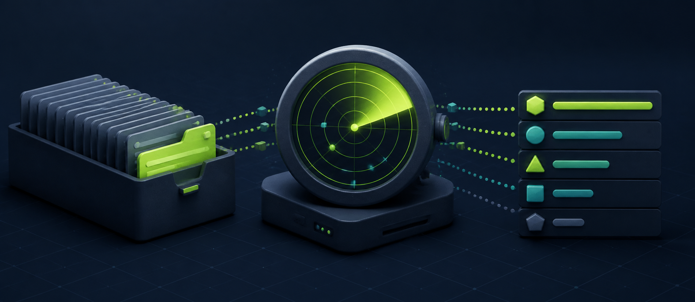
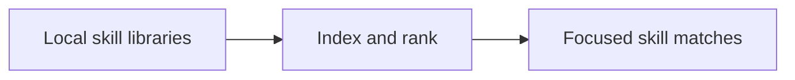

<!-- readme-refresh:start -->
<p align="center">
  <picture>
    <source media="(prefers-color-scheme: dark)" srcset="assets/readme-banner.png">
    <source media="(prefers-color-scheme: light)" srcset="assets/readme-banner.png">
    
  </picture>
</p>

<h1 align="center">📡 SkillRadar CLI</h1>

<p align="center"><strong>Find the right local SKILL.md with fast BM25 ranking.</strong></p>

<p align="center">
  <a href="https://github.com/al1re3a/skillradar-cli/actions/workflows/ci.yml"></a>
  <a href="https://www.python.org/"></a>
  <a href="LICENSE"></a>
  <a href="https://github.com/al1re3a/skillradar-cli/stargazers"></a>
  <a href="https://github.com/al1re3a/skillradar-cli/issues"></a>
</p>

<p align="center">
  <a href="https://github.com/al1re3a/skillradar-cli"></a>
  <a href="#usage"></a>
  <a href="CONTRIBUTING.md"></a>
  <a href="SECURITY.md"></a>
</p>

<p align="center">
  
</p>

> [!NOTE]
> Search runs locally without embeddings or network calls; ranking quality follows the text available in each skill.

## 📑 Contents

- [At a glance](#-at-a-glance)
- [Why](#why)
- [Usage](#usage)
- [Ranking](#ranking)
- [Token-saving pattern](#token-saving-pattern)
- [Development](#development)

---

## 🔎 At a glance

| | |
|---|---|
| **Purpose** | Fast local BM25 search for SKILL.md libraries — find the right agent skill without wasting context. |
| **Input** | Local skill libraries |
| **Output** | Focused skill matches |
| **Runtime** | Python 3.10+ |
| **CI** | ✅ Linux · Windows |
| **Status** | ✅ Maintained |

<details>
<summary><strong>🧭 How it works</strong></summary>



</details>

<details>
<summary><strong>📁 Repository layout</strong></summary>

```text
skillradar-cli/
├── .github/
├── src/
├── tests/
├── examples/
├── pyproject.toml
└── README.md
```

</details>

<details>
<summary><strong>🤝 Contributors</strong></summary>

<br>
<a href="https://github.com/al1re3a/skillradar-cli/graphs/contributors">
  
</a>

</details>
<!-- readme-refresh:end -->

**Find the right agent skill without stuffing every description into context.**

SkillRadar discovers local `SKILL.md` files and ranks them with a small BM25 search index. It is fast, private, dependency-free, and compatible with skills stored for Codex, Claude Code, Cursor, or a custom agent.

```bash
skillradar "validate a PDF form"
```

## Why

Skill libraries are growing faster than context windows should. Injecting every skill description into every turn wastes tokens and still makes selection harder. SkillRadar retrieves a focused top-k list when it is needed.

## Usage

```bash
python -m pip install -e .

# Search common user and project skill directories
skillradar "analyze spreadsheet formulas"

# Search explicit libraries
skillradar "inspect PDF layout" --root ~/.agents/skills --root ./team-skills

# Agent-friendly output
skillradar "deploy site" --format json --top 5
skillradar "deploy site" --format compact

# Inventory
skillradar --list --root examples/skills
```

## Ranking

The index uses BM25 over names, descriptions, headings, and folder names, with an exact-name boost. No embedding model, API key, database, or background daemon is required. Results are recomputed from files, so they never go stale.

## Token-saving pattern

1. Keep only skill names in the base agent prompt.
2. Search SkillRadar using the current user request.
3. Inject descriptions for the top three to eight candidates.
4. Let the agent read only the selected `SKILL.md` files.

## Development

```bash
python -m unittest discover -s tests -v
```

## License

MIT
